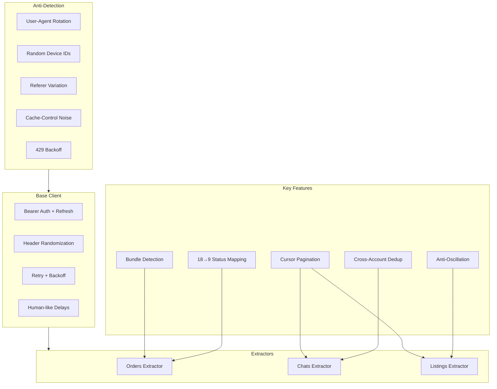

# Wallapop Data Extractors

**Reverse-engineered Wallapop API extractors for orders, conversations, and listings with anti-detection, token management, and anti-oscillation logic.**


---

## What it does

Three specialized extractors built on a shared base client, designed to interact with Wallapop's undocumented API:

**1. Orders Extractor** — Extracts active orders with multi-step enrichment: deliveries → tracking → item details → bundle detection. Maps Wallapop's 18+ internal states to 9 unified states for cross-platform compatibility.

**2. Chats Extractor** — Extracts messaging conversations with cursor-based pagination, change detection to avoid redundant updates, and cross-account deduplication for conversations visible from multiple seller accounts.

**3. Listings Extractor** — Extracts published product listings with anti-oscillation logic. Wallapop rotates product IDs every ~3 days; this extractor detects oscillations vs. genuine re-publications to preserve engagement metric history.

Built from a production system managing **5+ seller accounts** with **10,000+ listings** and **50,000+ conversations**.

## Architecture



## Anti-detection strategy

The base client implements multiple layers to avoid API blocking:

| Technique | Implementation |
|-----------|---------------|
| **User-agent rotation** | Pool of 8+ browser UAs, randomly selected per request |
| **Device ID randomization** | Android-style device IDs generated per request |
| **Header fingerprint variation** | Random Referer URLs (70% probability), Cache-Control noise (30%) |
| **App version variation** | Rotates between 5 app version strings |
| **Human-like delays** | Biased distribution: 70% short delays, 30% longer pauses |
| **Rate limit handling** | Exponential backoff with jitter on 429 responses |
| **Token auto-refresh** | Automatic bearer renewal on 401 without stopping extraction |

## Anti-oscillation logic (Listings)

```
Wallapop behavior:
  Day 1: Product "LPNAB123" has product_id "abc"
  Day 3: Re-published → product_id changes to "def"
  Day 6: Re-published → product_id changes back to "abc"

Without anti-oscillation:
  Stats reset on each ID change → lose views/favorites history

With anti-oscillation:
  1. Track previous_product_id
  2. If "new" ID matches previous → oscillation detected → swap without resetting
  3. Only genuinely new IDs trigger metric accumulation
  4. Each LPN processed once per run (first occurrence wins)
```

## Quick start

```bash
git clone https://github.com/AspiranteD/wallapop-data-extractors.git
cd wallapop-data-extractors
pip install -r requirements.txt
pytest tests/ -v
```

## Usage

### Orders

```python
from src.extractors import WallapopOrdersExtractor

extractor = WallapopOrdersExtractor(
    bearer_token="your-bearer-token",
    user_agents=["Mozilla/5.0 ..."],
)

results = extractor.extract()
for order in results["orders"]:
    print(f"{order['request_id']}: {order['internal_status']} - {order['item_title']}")
```

### Conversations

```python
from src.extractors import WallapopChatsExtractor

extractor = WallapopChatsExtractor(
    bearer_token="your-bearer-token",
    user_agents=["Mozilla/5.0 ..."],
)

results = extractor.extract()
print(f"Found {results['new']} new conversations")
```

### Listings with change detection

```python
from src.extractors import WallapopListingsExtractor

extractor = WallapopListingsExtractor(
    bearer_token="your-bearer-token",
    user_agents=["Mozilla/5.0 ..."],
)

results = extractor.extract()

# Compare with previous state for anti-oscillation
previous_state = load_previous_state()  # your persistence layer
deltas = extractor.detect_changes(
    [ListingResult(**l) for l in results["listings"]],
    previous_state,
)

for delta in deltas:
    if delta.change_type == "product_id_changed":
        print(f"{delta.lpn}: ID changed, accumulated {delta.accumulated_views} views")
    elif delta.change_type == "oscillation":
        print(f"{delta.lpn}: Oscillation detected, no metric reset")
```

### Token management

```python
from src.auth import TokenManager
from src.auth.token_manager import AccountCredentials

manager = TokenManager(refresh_callback=my_refresh_function)
manager.register_account(AccountCredentials(
    account_id="acc-1",
    account_name="Main Account",
    bearer_token="initial-token",
))

token = manager.get_token("acc-1")  # auto-refreshes if expired
```

## Project structure

```
wallapop-data-extractors/
├── src/
│   ├── extractors/
│   │   ├── base_client.py       # Abstract base: auth, headers, retries
│   │   ├── orders.py            # Order extraction + status mapping
│   │   ├── chats.py             # Chat extraction + deduplication
│   │   └── listings.py          # Listings + anti-oscillation
│   └── auth/
│       └── token_manager.py     # Multi-account token lifecycle
├── tests/
│   ├── test_base_client.py      # 10 tests - HTTP, retries, auth
│   ├── test_orders.py           # 7 tests - status mapping, LPN
│   ├── test_listings.py         # 9 tests - anti-oscillation
│   └── test_token_manager.py    # 7 tests - token lifecycle
└── requirements.txt
```

## Design decisions

**Why reverse-engineer instead of using an official API?**
Wallapop has no public API for sellers. All seller tools (order management, chat, analytics) operate through undocumented endpoints. This project reverse-engineers the mobile app and web client to provide programmatic access.

**Why anti-oscillation instead of just tracking the latest product_id?**
Without anti-oscillation, a listing with 500 views that gets re-published would appear to have 0 views. Over months, this compounds into massive data loss for analytics. The previous_product_id tracking ensures metrics survive ID rotations.

**Why randomize headers so aggressively?**
Wallapop actively fingerprints API consumers. Consistent headers from automated tools get blocked within hours. The randomization strategy (device IDs, referers, cache headers, delays) has maintained stable access across 5+ accounts for 6+ months in production.

## Related projects

- [AI Product Enrichment](https://github.com/AspiranteD/ai-product-enrichment) — AI-powered categorization and description generation
- [Amazon Product Scraper](https://github.com/AspiranteD/amazon-product-scraper) — ASIN scraper + manifest parser

## License

MIT
